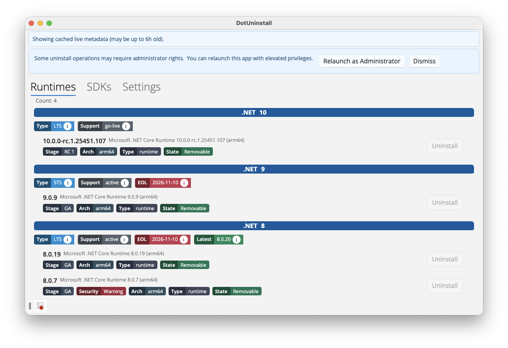

# DotUninstall: Cross Platform UI for .NET Uninstall Tool


A minimalist cross‑platform (Windows / macOS) graphical user interface that wraps the official `dotnet-core-uninstall` command‑line utility from Microsoft.

> This project is a community UI helper. It is **not** an official Microsoft application. Uninstalling SDKs/runtimes can impact existing projects—read the safety notes below.

## Why does this exist?

Managing many installed .NET SDK and runtime versions becomes cumbersome. The official `dotnet-core-uninstall` tool provides the correct uninstall logic and safety rules (e.g. protecting required or currently in‑use SDKs), but it is console-only. This UI layers discoverability, visual status, and one‑click removal while preserving the tool’s rules.

## Key Features



- Detects and lists installed .NET SDKs & runtimes using the same logic of `dotnet-core-uninstall` (including uninstallability reasons).
- Shows architecture, uninstallability, and reason (e.g. "Cannot uninstall SDK that is required...").
- One click uninstall.
- UI locking during operations to prevent re-entrancy.
- Status + error surface; reasons shown as tooltip and inline text.

## Supported Platforms

.NET SDKs/runtimes of supported versions (8+ right now) on Windows/macOS. Older .NET versions are supported in best-effort mode.

## Usage

1. Launch this app.
2. Review the listed SDKs & runtimes.
3. Uninstall an entry by pressing **Uninstall** (button is disabled if the reason indicates it is not allowed).
4. The UI locks and shows progress; when done, the list refreshes automatically.

## Safety / Disclaimer

- This UI only surfaces what the underlying tool allows. If the command line would refuse an uninstall, the UI should also reflect that.
- Always confirm you do not need a version for active projects or global build servers.
- If something fails, consider running the `dotnet-core-uninstall` tool manually for verbose diagnostics.
- Not affiliated with Microsoft. Use at your own risk.

## macOS Notes

### Gatekeeper / Unsigned App Launch

The distributed macOS builds are currently not code signed or notarized. Gatekeeper blocks first launch with:

> "DotUninstall" cannot be opened because the developer cannot be verified.

Choose one method to allow it:

1. Right‑click the app bundle (`DotUninstall (arm64).app` or `DotUninstall (x64).app`) and select Open, then Open again in the dialog (Gatekeeper remembers).
1. Double‑click (blocked), then open System Settings → Privacy & Security, click Allow Anyway, relaunch and confirm.
1. Remove the quarantine flag (CLI approach):

  ```bash
  xattr -d com.apple.quarantine "/Applications/DotUninstall (arm64).app"  # adjust path if placed elsewhere
  ```

1. (Optional) Ad‑hoc sign locally to silence further warnings:

  ```bash
  codesign --force --deep --sign - "/Applications/DotUninstall (arm64).app"
  spctl --assess --verbose "/Applications/DotUninstall (arm64).app"  # should report 'accepted'
  ```

#### Verify Download Integrity (Recommended)

Compute SHA256 and compare with the value posted on the release page:

```bash
shasum -a 256 "DotUninstall-macos-<version>.dmg"
```

Proceed only if the hash matches. Always download from the official GitHub Releases page.

#### Security Considerations

- Removing quarantine or self‑signing trusts current contents; re‑download for updates rather than modifying internals.
- Organizations can re‑sign/notarize internally if required.

### Elevation / Permissions

If you installed .NET SDKs/runtimes system-wide (typically under `/usr/local/share/dotnet`) some uninstall operations require elevated rights. The app will prompt for your password via a standard macOS dialog when needed.

## Run

### Prebuilt Binaries

Release binaries are available on the [Releases](https://github.com/lextudio/DotUninstall/releases) page.

### Build from Source

From repository root:

```bash
git submodule update --init --recursive
dotnet build DotNetUninstall/DotNetUninstall.csproj -c Debug
dotnet run --project DotNetUninstall/DotNetUninstall.csproj
```

## Project Structure (Simplified)

```text
DotNetUninstall/
  App.xaml / App.xaml.cs      - Application bootstrap (Uno single-project)
  Presentation/               - UI pages, view models, converters
  Models/                     - Data record for install entries
  ReadMe.md                   - This document
```

## Localization

Strings are currently inline. Future enhancement: move UI labels and status messages into resource files for easy translation.

## Roadmap / Ideas

- Custom filtering and sorting.
- Theming toggle and high contrast improvements.
- Optional confirmation dialog before uninstall.
- Light telemetry (opt-in) for which commands are used (never collecting personal data).
- Linux support.

## Offline / Cached Metadata

The app enriches entries with lifecycle & latest info. In offline or restricted environments it falls back to an embedded snapshot and/or a local disk cache. See the contributor documentation for full details, update scripts, cache TTL, and CI automation:

- [docs/offline-metadata.md](./docs/offline-metadata.md)

## Contributing

PRs and issues welcome. Please:

1. Open an issue describing the change.
2. Keep UI changes accessible (keyboard navigation & contrast).

## License

This project is licensed under the [MIT License](./LICENSE). You are free to use, modify, and distribute with attribution and inclusion of the license text.

## Acknowledgements

- Microsoft `dotnet-core-uninstall` team for the underlying logic.
- Uno Platform for cross-platform UI.
